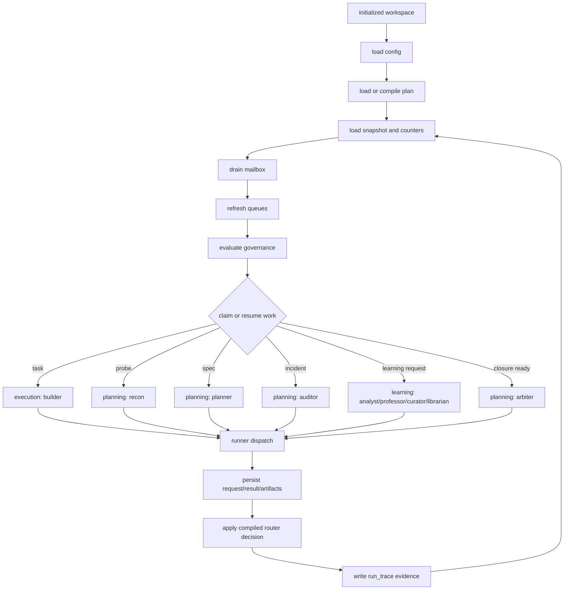

# Millrace Runtime Lifecycle Diagram

This is a compact Rust lifecycle chart for the current compiled-plan runtime.

## v0.18.3 Learning Path

In learning-enabled modes, a Planner `PLANNER_COMPLETE` result can enqueue a
targeted Librarian request. The request preserves the stage-result artifact,
Planner-produced artifacts, and source work-item metadata. A later learning
claim dispatches Librarian from the compiled learning graph. Librarian complete
and no-op outcomes move the learning request to done; blocked outcomes preserve
recoverable-failure evidence.

Default modes remain serial and do not enqueue Planner-to-Librarian learning
requests. Daemon learning concurrency still applies only through compiled
plane-concurrency policy.
